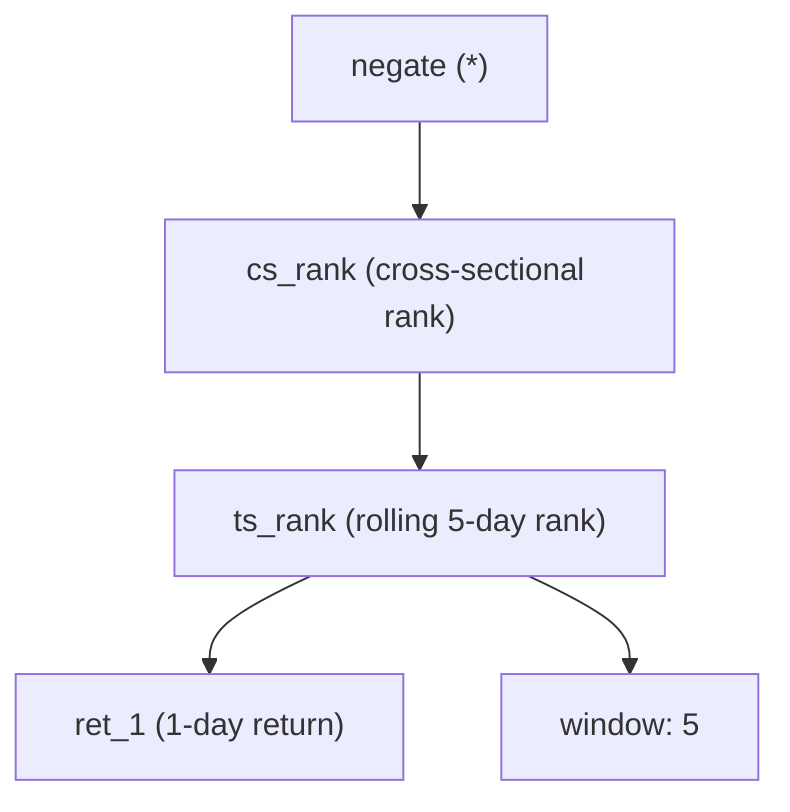

Formulaic alpha is best understood as **symbolic research under market constraints**. A researcher writes—or a search system proposes—a compact expression from a controlled language. The expression turns information that was available at a decision time into a cross-sectional forecast. It is not a trading strategy by itself. It becomes one only after risk control, costs, and execution are added.

That distinction is more than tidy notation. It is the difference between a clever backtest and a deployable investment process.

## 1. What a formulaic alpha is

At decision time $t$, let $U_t$ be the *point-in-time* investable universe and let $X_{t-L+1:t}$ contain only data known by then: adjusted prices, volumes, fundamentals with their publication timestamps, estimates, and approved alternative data. A formulaic alpha is a closed-form function in a domain-specific language (DSL):

$$
s_t=f\left(X_{t-L+1:t}, U_t\right) \in \mathbb{R}^{|U_t|}.
$$

The output $s_{i,t}$ is a score for asset $i$, not a promised return. The usual target is a future, executable-horizon return,

$$
y_{i,t}^{(h)}=\frac{P^{\mathrm{exec}}_{i,t+\delta+h}}{P^{\mathrm{exec}}_{i,t+\delta}}-1,
$$

where $\delta$ is the delay from observing the signal to the first tradable price. Defining $\delta$ explicitly prevents a common error: using a closing value to trade at that same close.

Think of the formula as a microscope, not a factory. It magnifies one possible pattern in a large data panel. Portfolio construction decides whether that pattern is useful after the rest of the book is visible:

$$
w_t=\arg\max_{w\in\mathcal C_t}\left\{w^\top\hat\mu_t-\lambda w^\top\Sigma_t w-\eta\,\widehat{\mathrm{TC}}(w-w_{t-1})\right\}.
$$

Here $\hat\mu_t$ may be based on several alpha scores, $\Sigma_t$ is a risk model, $\widehat{\mathrm{TC}}$ estimates trading costs, and $\mathcal C_t$ encodes exposure, liquidity, borrow, leverage, and concentration limits. Keeping $f$ separate from this optimizer makes both research and audit much clearer.

### A small example, with a large caveat

One well-known published example is Kakushadze's Alpha #101:

$$
\operatorname{Alpha101}=\frac{\operatorname{close}-\operatorname{open}}
{\operatorname{high}-\operatorname{low}+0.001}.
$$

It measures where the session's body sits inside its intraday range. A positive value means the close exceeded the open; the denominator scales that move by the day’s range and avoids division by zero. It is often described as a short-horizon momentum-like signal, but that is an empirical hypothesis, not a universal law. Its sign, availability convention, corporate-action treatment, and performance must be re-tested for the market and trading clock in use. The original paper presents 101 explicit formulas and code-like definitions; it does not grant any formula a permanent edge. [Kakushadze (2016)](https://arxiv.org/abs/1601.00991)

## 2. The language: formulas as typed abstract syntax trees

The key engineering choice is to represent an expression as an **abstract syntax tree (AST)**. An AST stores meaning, not merely text. In `ts_rank(ret_1, 5)`, the root is `ts_rank`; its children are the return series and a five-day lookback. That structure lets a system validate, cache, compare, mutate, and explain a formula safely.

A compact grammar can be written as:

$$
\begin{aligned}
e &::= \texttt{field} \mid \texttt{constant} \\
  &\quad\mid\, u(e) \mid b(e,e) \\
  &\quad\mid\, ts(e,d) \mid ts_2(e,e,d) \\
  &\quad\mid\, cs(e) \mid neutralize(e,g)
\end{aligned}
$$

where $u$ is a unary operator, $b$ is a binary operator, $d$ is a permitted lookback, and $g$ is a point-in-time grouping such as industry. In practice, each node also carries metadata: value type, units, frequency, lookback, warm-up requirement, missing-value behavior, and data-availability timestamp.

For example, a simple expression might be

$$
\alpha_t=-\operatorname{cs\_rank}\left(\operatorname{ts\_rank}(r_{1,t}, 5)\right).
$$

Read it from the leaves upward: calculate each asset’s one-period return, rank that return within the asset’s last five observations, rank those values across today’s universe, then reverse the sign. The economic story is a short-horizon reversal hypothesis. The AST is the wiring diagram that makes that story testable.

| Node family | Examples | Question it answers |
|---|---|---|
| Terminals | `open`, `close`, `volume`, `eps`, `estimate_revision` | What information is allowed in? |
| Arithmetic and guards | `add`, `subtract`, `signed_power`, `safe_divide` | How are quantities combined without unstable edge cases? |
| Time-series operators | `ts_mean(x, d)`, `ts_rank(x, d)`, `ts_delta(x, d)`, `ts_corr(x, y, d)`, `decay_linear(x, d)` | How has one asset behaved through time? |
| Cross-sectional operators | `cs_rank(x)`, `zscore(x)`, `winsorize(x)` | How does an asset compare with its peers today? |
| Group and risk operators | `neutralize(x, industry)`, `residualize(x, B_t)` | Is the apparent signal just sector or known-factor exposure? |

### Type checks are research controls, not decoration

An untyped expression generator will eventually propose nonsense: `price + volume`, a rolling window with a future endpoint, or a cross-sectional rank inside a time-series operator with ambiguous timing. A strong DSL blocks such forms before evaluation. It can require, for example, that `ts_corr` receive two aligned series, `cs_rank` receive an asset vector at one timestamp, and `neutralize` receive a contemporaneous, point-in-time group label.

Types cannot prove economic value. They can make invalid mathematics, undefined windows, and many timing mistakes impossible to express. That is a major gain when a system evaluates thousands of candidates.

## 3. The lineage: libraries, benchmarks, and search

Formulaic alpha did not begin with large language models. Its modern lineage has three useful reference points:

1. **Alpha101.** Kakushadze’s 2016 collection made a broad set of explicit, short-horizon symbolic formulas widely discussable and reproducible. It helped establish the formula-as-program idiom. [Paper](https://arxiv.org/abs/1601.00991)
2. **GTJA Alpha191.** The widely circulated Alpha191 collection expanded the practical vocabulary, particularly in Chinese-market research. It is best treated as a historical formula registry, not as a guaranteed, market-neutral benchmark; implementations vary in conventions and data handling.
3. **Qlib Alpha158.** Microsoft Qlib’s Alpha158 is a 158-feature data handler used in machine-learning benchmarks. It contains engineered price and volume features and is valuable for reproducible model comparison. It should not be conflated with a curated set of 158 standalone tradable alphas. [Qlib paper](https://www.microsoft.com/en-us/research/publication/qlib-an-ai-oriented-quantitative-investment-platform/) and [Alpha158 documentation](https://github.com/microsoft/qlib/blob/main/docs/component/data.rst)

These resources are a shared vocabulary, much like standard test cases in software. They do not replace a point-in-time dataset, an execution model, or independent validation. Automation followed naturally because the number of legal trees grows explosively as terminals, operators, and windows are added.

## 4. The search taxonomy: different engines, the same hard problem

Every discovery method must balance three competing goals: find predictive expressions, keep them interpretable, and avoid producing a thousand aliases for the same idea. The methods differ mainly in how they explore the AST space and how they allocate expensive backtests.

### Genetic programming (GP): evolve trees

GP maintains a population of ASTs. Selection favors a fitness score; mutation replaces a node or subtree; crossover swaps subtrees between parents. Strongly typed GP and complexity penalties are essential. Without them, the method tends to create long, fragile expressions that memorize the development period. Quality-diversity methods improve the process by retaining useful candidates in distinct behavioral niches rather than selecting only the top in-sample score. [AutoAlpha](https://arxiv.org/abs/2002.08245) is an example of this line of work.

### Reinforcement learning (RL): construct a formula one action at a time

In tree-building RL, the state is a partial AST and an action appends a terminal, operator, or close-tree token. A policy learns to maximize a delayed reward after the completed formula is tested. This is attractive when the reward can include net IC, turnover, complexity, and novelty. It is also brittle: noisy backtests produce noisy rewards, and a poorly designed reward invites reward hacking. A good RL system uses grammar masks, repeated seeds, uncertainty-aware evaluation, and a reward based on **marginal portfolio contribution**, not raw in-sample IC alone. [Synergistic alpha collections via RL](https://arxiv.org/abs/2306.12964) makes this portfolio-level objective explicit.

### GFlowNets: sample a *set* of good, diverse trees

A generative flow network aims to sample terminal formulas with probability proportional to a positive reward:

$$
p(\alpha)\propto R(\alpha).
$$

Unlike an optimizer that repeatedly returns one peak, a GFlowNet can preserve several high-reward modes. That matters when a portfolio needs unrelated mechanisms—say, a liquidity pattern, an earnings-revision signal, and a residual reversal signal—rather than 30 cosmetic variants of momentum. The reward should combine predictive quality, cost, complexity, and novelty, and it must be computed only on the development set. Recent alpha-discovery work applies trajectory-balance objectives to AST generation for precisely this diversity problem. [AlphaSAGE preprint](https://openreview.net/pdf?id=zRKF4ln2VE)

### LLM-guided search and LLM-MCTS: reason, propose, then verify

An LLM is useful as a proposal and explanation layer, not as an oracle for returns. It can translate a thesis such as “prefer high-volume pullbacks within industries” into a typed candidate, explain an unfamiliar tree, or suggest a repair after a diagnostic failure. [Alpha-GPT](https://arxiv.org/abs/2308.00016) is an early human–AI formulation of this pattern.

Monte Carlo tree search (MCTS) adds disciplined allocation. A node represents a partial or complete AST; the system selects branches using an exploration–exploitation rule, expands legal children, evaluates completed candidates, and backs the score up the tree. An LLM can supply a prior over promising expansions and turn evaluator output into a new hypothesis. MCTS should still include uncertainty penalties, subtree-frequency penalties, and held-out gates. Otherwise it simply becomes a more eloquent way to overfit. [Navigating the Alpha Jungle](https://ojs.aaai.org/index.php/AAAI/article/download/37069/41031) illustrates the LLM–MCTS approach.

### Multi-agent autonomous quants: separate authority, not just prompts

A robust agentic system assigns narrow roles with explicit handoffs:

The researcher proposes a mechanism and candidates. The compiler produces only valid ASTs. The timing guardian checks timestamps, universe membership, and data provenance. The evaluator runs the fixed experiment. The portfolio steward tests incremental value. An independent critic can reject a claim that rests on a fragile subperiod or a hidden exposure. This separation is valuable because no one agent should be able to both invent a formula and redefine the test that approves it.

### Memory-driven reflection: learn from evidence, not from flattering prose

Research memory should store structured records: formula hash and canonical AST, dataset version, split, metrics, exposures, turnover, failure codes, and a short mechanism note. Retrieval should include strong candidates *and* informative failures: “worked only in microcaps,” “was industry momentum in disguise,” or “lost all net edge after costs.” The model can then avoid known dead ends while a human can audit why a path was abandoned. This is contextual policy improvement; it does not imply that the base LLM has retrained itself.

## 5. The non-negotiable layer: sealed evaluation and anti-leakage tests

A sealed sandbox accepts a serialized AST, never arbitrary generated code. It evaluates against immutable, versioned feature tensors and returns a limited diagnostics object. This improves security, reproducibility, and comparability. It is not, by itself, proof against leakage. The controls below make the claim credible.

| Control | What it prevents | Evidence to retain |
|---|---|---|
| Point-in-time data ledger | Restated fundamentals, stale constituents, and future analyst estimates | Vendor version, as-of time, availability lag, universe snapshot |
| Clock contract | Trading a signal before it could be known | Decision, order, fill, and label timestamps |
| Immutable splits | Quietly retuning on the final test period | Hashes for train, development, validation, and untouched test windows |
| AST-only execution | Arbitrary I/O, hidden code paths, and unreviewed features | Formula JSON, grammar version, validator log |
| Purged, embargoed validation | Label overlap across nearby observations | Fold definitions and embargo length |
| Cost and capacity model | Paper profits that cannot be traded | Spread, impact, borrow, ADV, and participation assumptions |
| Reproducibility record | Results that cannot be recreated | Data hash, code/image hash, random seeds, and full configuration |

Use walk-forward development, not one flattering train/test split. Keep the final holdout inaccessible to the generator and its memory until the research specification is frozen. Audit every transform, including winsorization, imputation, normalization, and group labels, for its fitting window. A model can leak without ever touching a future price—for example, by using a modern index constituent list in an old backtest.

## 6. Score a factor as a portfolio contribution, not a trophy

For cross-sectional work, a useful first diagnostic is the daily Spearman information coefficient:

$$
\operatorname{RankIC}_t=\operatorname{corr}_{\mathrm{Spearman}}(s_t,y_t^{(h)}).
$$

Report its mean, dispersion, serial dependence, and a heteroskedasticity-and-autocorrelation-consistent (HAC) t-statistic. Then ask harder questions: Does the signal survive by sector, size, volatility regime, and geographic market? Does it work after the assumed delay and costs? Does the result belong to a coherent economic mechanism, or to one lucky window?

Most importantly, test the candidate after accounting for the existing book. Let $B_t$ contain approved alpha and risk exposures. A simple residualized score is

$$
\tilde{s}^{(k)}_t=(I-P_{B_t})s^{(k)}_t,
\qquad
P_{B_t}=B_t(B_t^\top B_t)^{-1}B_t^\top,
$$

with regularization where needed. Evaluate $\tilde{s}^{(k)}_t$, its marginal effect on the optimizer, and its net contribution to portfolio P&L. A factor with a lower standalone IC can be more valuable if it diversifies the book during stressed markets.

### Multiple testing is part of the model

An autonomous system can test far more expressions than a human. Therefore a plain “$t>2$” rule is not meaningful. Maintain a candidate ledger that counts rejected formulas and records adaptive search paths; use family-wise error-rate controls when false positives are costly, false-discovery-rate controls for large exploratory families, and deflated or reality-check-style performance tests where appropriate. Most of all, reserve a final untouched period. Harvey, Liu, and Zhu showed why conventional significance thresholds are too weak in a factor-rich research setting. [Their paper](https://www.nber.org/papers/w20592) remains essential reading.

## 7. A practical institutional workflow

1. **Write the research contract.** State the market, universe, decision clock, target return, rebalancing rule, costs, constraints, and acceptance gates before generation begins.
2. **Build the typed DSL and point-in-time panel.** Limit terminals and windows to approved data. Include operator semantics, safe numerical behavior, and canonical AST hashing.
3. **Generate broadly, evaluate narrowly.** Use GP, RL, GFlowNets, LLM–MCTS, or a hybrid, but send every candidate through the same sealed evaluator.
4. **Select families, not winners.** Cluster by AST shape, score correlation, and economic mechanism. Keep only candidates with distinct residual value.
5. **Validate honestly.** Walk forward, apply costs and capacity, correct for search multiplicity, and open the final holdout only once.
6. **Deploy with monitoring and a kill policy.** Track live versus simulated IC, exposures, turnover, slippage, drift, and data-quality events. Retirement is a valid outcome.

## Closing perspective

The advance from Alpha101 and Alpha191 to Alpha158 benchmarks, symbolic search, and LLM-guided agents is not a story of machines discovering a perpetual money formula. It is a story of better research machinery. Typed ASTs make ideas precise. GP, RL, GFlowNets, and MCTS search more efficiently. Multi-agent roles and memory make the process easier to inspect. Sealed sandboxes and anti-leakage harnesses make results harder to fake by accident.

The durable edge is not the largest factor zoo. It is the ability to reject attractive mistakes quickly, preserve independent evidence, and combine only the signals that improve a realistic portfolio.

---

### Selected references

- Z. Kakushadze, [*101 Formulaic Alphas*](https://arxiv.org/abs/1601.00991), 2016.
- T. Zhang et al., [*AutoAlpha: an Efficient Hierarchical Evolutionary Algorithm for Mining Alpha Factors*](https://arxiv.org/abs/2002.08245), 2020.
- X. Yang et al., [*Qlib: An AI-oriented Quantitative Investment Platform*](https://www.microsoft.com/en-us/research/publication/qlib-an-ai-oriented-quantitative-investment-platform/), 2020; [Alpha158 documentation](https://github.com/microsoft/qlib/blob/main/docs/component/data.rst).
- S. Wang et al., [*Alpha-GPT: Human-AI Interactive Alpha Mining for Quantitative Investment*](https://arxiv.org/abs/2308.00016), 2023.
- S. Yu et al., [*Generating Synergistic Formulaic Alpha Collections via Reinforcement Learning*](https://arxiv.org/abs/2306.12964), 2023.
- C. Harvey, Y. Liu, and H. Zhu, [*… and the Cross-Section of Expected Returns*](https://www.nber.org/papers/w20592), 2016.

*Educational material only; it is not investment advice or a recommendation to trade any security.*
