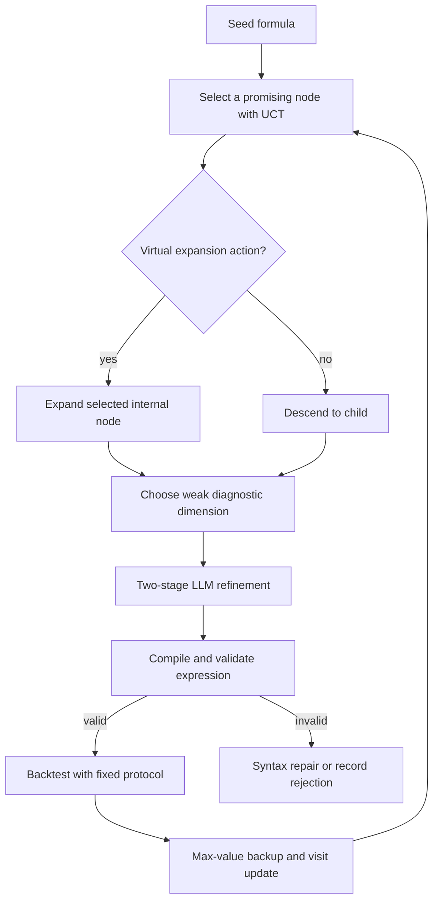

Genetic programming (GP) is a natural baseline for formulaic alpha discovery: mutate expression trees, retain high-scoring candidates, and repeat. Its weakness is not that mutation is invalid, but that it spends most of its budget in an enormous symbolic space with sparse feedback. Reinforcement learning (RL) and Monte Carlo Tree Search (MCTS) offer a different control loop: construct and refine expressions sequentially, using evaluation feedback to decide which partial search paths deserve more computation.

This post separates the two ideas that are often conflated. RL supplies a policy for proposing construction actions; MCTS allocates search effort among those proposals. The resulting system is still only as credible as its data timing, evaluation design, and transaction-cost model.

## 1. From population mutation to sequential decisions

An expression can be represented as a sequence of tokens or as a syntax tree. In an RL formulation, the partial expression is the state $s_t$, the next operator, feature, or constant is the action $a_t$, and the terminal reward measures a valid completed formula. This is attractive because the policy can learn which continuations tend to lead to useful expressions.

The difficulty is delayed reward. Most partial programs are unevaluable, and many complete ones are invalid or uninformative. Trajectory-level reward shaping can provide intermediate guidance from expert formula structures, but it also risks baking existing conventions into the policy and narrowing exploration. Reward shaping should be treated as a prior, not evidence of alpha.

## 2. Alpha2 constrains construction before evaluation

[Alpha2](https://arxiv.org/abs/2406.16505) is not simply a token generator. It builds programs through register-based, structured instruction actions, controls expression length, and uses pre-calculation dimensional analysis to reject invalid operations before a backtest. The latter matters: an expression that adds a price quantity to a share-volume quantity may be syntactically executable but has no coherent dimensional interpretation.

Its reward and tree search therefore operate in a restricted action space. That is distinct from reverse-Polish-notation generation and from AlphaJungle's LLM-mediated refinement of a complete candidate. Alpha2 reports that this combination improves both effectiveness and average factor diversity relative to its reported GP and AlphaGen baselines; those figures remain specific to its data and experimental protocol.

## 3. MCTS makes refinement paths explicit

[AlphaJungle](https://arxiv.org/abs/2505.11122) uses an LLM to propose refinements while MCTS decides where to expand. A node represents a candidate formula with its evaluation history; an edge is a refinement proposal. A standard UCT-style selection score balances estimated value against under-exploration:

$$
a^* = \arg\max_a \left[Q(s,a) + c\sqrt{\frac{\log N(s)}{N(s,a)}}\right].
$$

Here $Q(s,a)$ is the best observed descendant outcome in the AlphaJungle implementation, $N(s)$ the parent visit count, $N(s,a)$ the action visit count, and $c$ the exploration coefficient. The equation is a budget-allocation rule, not a proof that a selected formula will generalize.

## 4. AlphaJungle navigates by weaknesses, not only score

The valuable feature in AlphaJungle is multi-dimensional feedback. A candidate is assessed for **Effectiveness, Diversity, Turnover, Stability, and Overfitting Risk**; the next refinement samples a weak dimension rather than blindly mutating the formula. A high-IC but high-turnover candidate may therefore receive a prompt aimed at smoothing or decay, whereas a redundant candidate may receive a diversity-oriented prompt. These diagnostics direct search; they are not a composite proof of quality.

The same paper introduces frequent subtree avoidance (FSA). It abstracts expressions so that parameter variants of the same motif can be recognized, identifies frequently recurring subtrees, and asks the generator to avoid them. This is a structural diversity constraint: it prevents the search from spending its entire budget on near-duplicates such as many window-length variants of one moving-average structure.

| Search component | Role | What it does not establish |
|---|---|---|
| RL policy | Proposes likely useful actions | Causal validity or economic mechanism |
| MCTS | Allocates trials across refinements | Out-of-sample profitability |
| Targeted diagnostics | Directs revision toward a weak metric | Stability under a new market regime |
| FSA | Reduces repeated expression motifs | Low portfolio correlation by itself |

| Method | Search unit | Validity enforcement | Diversity mechanism | Principal cost |
|---|---|---|---|---|
| GP | Population of expression trees | Usually operator design and post-hoc checks | Population variation | Large population evaluation |
| Alpha2 | Register-based program construction | Legal actions and dimensional pruning | Rewarded performance/diversity | Tree search and value estimation |
| AlphaJungle | LLM refinement tree | Parsing plus repair loop | FSA and diagnostic targeting | LLM and backtest calls per expansion |

## 5. The comparison with GP is a control comparison

GP uses population-level selection and stochastic crossover or mutation. It can be fast and effective when the representation and operators are carefully constrained. Guided tree search instead preserves a refinement history and can spend additional budget on a promising intermediate expression. This is useful when an LLM can make semantically meaningful edits, but it carries substantial latency: each expansion can require generation, parsing, evaluation, and bookkeeping.

Empirical improvements reported for AlphaJungle should be read as results under its specific universe, preprocessing, backtest protocol, and baselines—not as a transferable performance target. Its reported ablations compare chain- and tree-of-thought baselines, MCTS, and MCTS with FSA under a common setting. Reimplementation should repeat that design with the test period, model, number of expansions, and LLM/backtest budget reported explicitly.

## 6. Deployment constraints are part of the algorithm

> **Timing warning.** An LLM-guided tree can repeatedly discover expressions that look compelling under a permissive evaluator. Causal operator constraints and a final untouched test set are required independently of how sophisticated the search policy is.

Three implementation limits matter in practice:

1. **Budget:** MCTS can multiply LLM and backtest calls; use explicit expansion and wall-clock limits.
2. **Evaluation noise:** a node value estimated from one backtest is a noisy statistic; prefer repeated, regime-aware validation.
3. **Diversity measurement:** avoiding common syntax does not necessarily avoid common economic exposure. Test return correlation and marginal portfolio contribution separately.

## Conclusion

The advance beyond GP is not the replacement of one heuristic with a magical reasoning model. It is a more explicit search controller: a policy proposes changes, MCTS records and allocates evidence, diagnostics decide what to repair, and FSA limits syntactic crowding. The system becomes credible only when those search innovations remain inside a fixed, causal evaluation boundary.

## References

1. Y. Shi, Y. Duan, and J. Li, [Navigating the Alpha Jungle: An LLM-Powered MCTS Framework for Formulaic Factor Mining](https://arxiv.org/abs/2505.11122), 2025.
2. F. Xu et al., [Alpha2: Discovering Logical Formulaic Alphas using Deep Reinforcement Learning](https://arxiv.org/abs/2406.16505), 2024.
