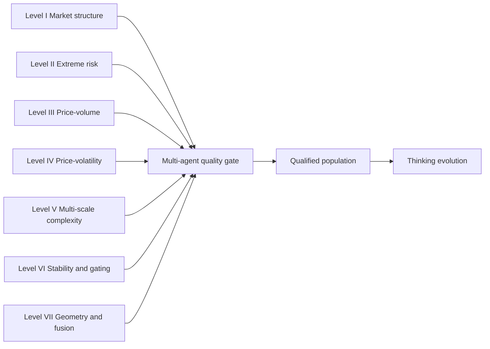

Formulaic-alpha search usually varies expressions inside one common population. CogAlpha takes a different position: diversity should enter before selection, through specialized agents that look for different classes of market mechanism. Its seven-level hierarchy spans market structure and cycles; extreme risk and fragility; price-volume dynamics; price-volatility behavior; multi-scale complexity; stability and regime gating; and geometric and factor-fusion mechanisms. A multi-agent quality process then decides which candidates may enter an evolutionary loop.

That is a stronger claim than "use many agents." Specialization is valuable only when agents have distinct objectives, the quality gate is explicit, and the final results are tested without allowing the generator to redesign the evaluator. The architecture and experiments are described in [Cognitive Alpha Mining via LLM-Driven Code-Based Evolution](https://arxiv.org/abs/2511.18850).

## 1. A hierarchy is a coverage map, not a chain of command

CogAlpha organizes 21 agents into seven analytical layers. The top levels search broad market structure and extreme-risk mechanisms; the middle levels address price-volume dynamics and price-volatility behavior; later levels consider multi-scale complexity, stability and regime gating, and geometric or composite constructions. The aim is to prevent a single language model from repeatedly proposing the familiar mechanisms most available in its prompt context.

These are parallel sources of hypotheses, not sequential processing stages. The paper distributes 21 specialized agents across the layers; the labels above are explanatory glosses rather than replacements for the individual agent roles. The quality gate establishes a common interface for comparison.

## 2. Leap-style creativity is constrained variation

CogAlpha's "thinking evolution" uses LLMs to mutate, recombine, and improve candidate factor code. Its diversified guidance mechanism varies the research instruction through light, moderate, creative, divergent, and concrete modes. Creative and divergent prompts seek alternative transformations or mechanisms; concrete prompts ask for directly implementable formulas. "Leap-style creativity" is editorial shorthand for this controlled prompt variation, not evidence that a generated formula is economically valid.

The word *creativity* is easy to overstate here. The useful operational meaning is controlled hypothesis variation. A creative prompt is not evidence of a new anomaly. It is an attempt to generate candidates outside a narrow syntactic neighbourhood, followed by the same validity and empirical tests applied to ordinary candidates.

## 3. The quality hierarchy determines what may evolve

CogAlpha's quality checker applies multiple filters before a formula contributes to the next generation. Code errors, runtime failure, and excessive missingness are hard failures. Surviving candidates are evaluated with IC, ICIR, RankIC, RankICIR, and mutual information. Candidates above the reported generation-relative qualification threshold enter the parent pool; those above the stricter elite threshold are retained unchanged. Diversity is an architectural objective and a deployment diagnostic, rather than one of these stated hard gates.

| Stage | Question | Typical rejection reason |
|---|---|---|
| Code quality | Can the factor be evaluated safely? | Syntax, runtime, or excessive missing values |
| Predictive screen | Does it show a usable association in the specified validation protocol? | Weak IC/RankIC or unstable estimate |
| Deployment diversity diagnostic | Does it add a distinct signal family? | Redundant exposure or near-duplicate structure |
| Elite retention | Is it strong enough to preserve unchanged? | Fails the stricter generation threshold |

This is a quality hierarchy, not a proof of generalization. Percentile thresholds are relative to a generation: a weak population can still yield a "top" candidate. Absolute thresholds, economic rationale, cost-aware backtests, and a final sealed evaluation remain necessary.

## 4. What the component evidence establishes

The CogAlpha paper reports an ablation in which evolutionary search is augmented sequentially with adaptive mechanisms, diversified guidance, and the analytical hierarchy. In its CSI300, ten-day-horizon setting, the full system improves reported IC, RankIC, information ratio, and annualized excess return relative to earlier component configurations. Those results support the architecture under that setup; they are not a live-performance estimate.

| Configuration | Added capability | What the comparison tests |
|---|---|---|
| Evolution only | Code-level evolution | Baseline search loop |
| Plus adaptive mechanism | Adaptive control | Whether adaptation improves the loop |
| Plus diversified guidance | Prompt-level hypothesis variation | Whether varied guidance broadens the candidate set |
| Full CogAlpha | Seven-level hierarchy | Whether specialized sources improve the evaluated pool |

The comparison should be reproduced with repeated runs, the complete split convention, and the number of factors tested reported. Twenty-one generators enlarge the multiple-testing surface; without a sealed final test, a component ablation can overstate a search advantage.

## 5. Why a seven-level design can help—and when it can fail

The architecture has three plausible advantages. It expands the hypothesis vocabulary, assigns distinct analytical roles instead of one generic prompt, and gives the evolution stage an initial population with more diverse structure. The CogAlpha paper reports improvements from progressively adding its adaptive, diversified-guidance, and hierarchy components on its experimental setting.

But specialization can also introduce correlated failure. Multiple agents may share the same data, model prior, operator set, and selection metric; their outputs can therefore be more similar than their labels suggest. More agents also create a larger multiple-testing surface. The appropriate diagnostic is not the number of roles, but out-of-sample marginal contribution after costs and correlations are measured.

## 6. Practical safeguards for a cognitive search system

> **Evaluation boundary.** A multi-agent generator must never control the data timestamping, target construction, final test window, or transaction-cost assumptions used to judge its own candidates. Otherwise the hierarchy increases the capacity to exploit an evaluator rather than the capacity to discover a signal.

A practical implementation should retain:

1. a causal operator registry or parser that rejects invalid time access;
2. independent validation and final test periods;
3. a fixed compute budget per layer so one prolific agent cannot dominate by volume;
4. factor-level and portfolio-level diversity metrics; and
5. logging of rejected as well as retained candidates, including the reason for rejection.

These safeguards make the evolutionary memory useful: the system can learn which mechanisms failed under a fixed protocol without rewriting the protocol after the fact.

## Conclusion

CogAlpha's contribution is architectural. It treats broad analytical coverage, controlled candidate variation, and quality-gated evolution as separate jobs. That separation can make an LLM-based search more interpretable than a single free-form generator, but it cannot replace causal data handling or untouched out-of-sample validation. The system is strongest when its creativity is bounded by explicit research controls.

## References

1. F. Liu et al., [Cognitive Alpha Mining via LLM-Driven Code-Based Evolution](https://arxiv.org/abs/2511.18850), 2025.
