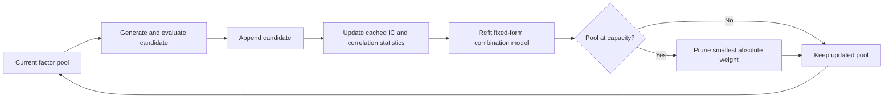

An alpha factor should not be evaluated as though it will trade alone. If the production model combines a library of factors, the relevant question is not whether a candidate has a high standalone information coefficient (IC), but whether it improves the *combined* signal after the existing library is taken into account. This distinction turns alpha mining from a ranking problem into a sequential portfolio-construction problem.

The central design change in [AlphaGen](https://arxiv.org/abs/2306.12964) is to reward a generator with the updated pool's combined performance, rather than the isolated quality of one newly generated expression. The marginal expression below is the right *conceptual interpretation*; it is not a claim that the implementation uses that difference as its literal terminal reward. This correction to the usual "find the top-$k$ factors" workflow makes the search objective non-stationary and computationally demanding.

## 1. Why the best individual factor need not improve a factor library

Let $f$ denote a candidate formulaic alpha, $\mathcal{F}$ the factor library already selected, and $C(\mathcal{F})$ the combination model fitted on that library. A standalone search commonly maximizes an individual score such as $\operatorname{IC}(f, y)$, where $y$ is the future-return target. That procedure can keep returning small variants of the same market mechanism.

The portfolio-level objective is instead the marginal improvement

$$
\Delta(f \mid \mathcal{F}) = \operatorname{IC}(C(\mathcal{F}\cup\{f\}), y) - \operatorname{IC}(C(\mathcal{F}), y).
$$

The first term measures the combined model with the candidate; the second is the same model without it. A factor can have an attractive standalone IC and still have $\Delta \approx 0$ when its predictive content is already spanned by the library. Conversely, a modest standalone factor can be valuable if it contributes information in a different regime or through a different cross-sectional mechanism.

This is not a claim that pairwise correlation alone determines diversification. It is a *conditional* test: the marginal value depends on the fitting procedure, target, sample, regularization, and existing factors. Those choices must remain fixed during candidate comparison.

## 2. AlphaGen changes the reward, not merely the generator

AlphaGen models formula construction as a reinforcement-learning problem: an agent emits a symbolic expression token by token, then receives a reward after it can be evaluated. The distinctive part is the reward. Rather than returning only the new formula's IC, the framework assigns credit according to its contribution to the combination model's performance. The result is an explicit incentive to find factors that are useful *in context*. [Yu et al.](https://arxiv.org/abs/2306.12964) describe this as generating a synergistic collection rather than mining factors independently.

The diagram's important boundary is the fixed *combiner form and evaluation protocol*, not fixed weights: the weights are refitted after a candidate is appended. Allowing the agent to modify labels, splits, costs, or the evaluation rule converts an alpha-search reward into an opportunity for reward hacking.

## 3. The reward landscape is deliberately non-stationary

Once a library changes, the same formula has a different marginal value. A momentum-like expression may be highly useful early in a search and redundant after several related momentum factors have been admitted. AlphaGen's construction state is the partial formula sequence; the externally updated pool is what makes the reward landscape non-stationary. Treating each candidate as an independent score discards the dependency the method is designed to exploit.

This has two consequences.

| Design choice | What it encourages | Failure mode if omitted |
|---|---|---|
| Standalone IC reward | Locally predictive formulas | Redundant factor families |
| Marginal combination reward | Complementary predictive content | Expensive, non-stationary evaluation |
| Fixed held-out test | Honest final estimate | Selection leakage from repeated testing |

The 2024 follow-on work on [synergistic formulaic alpha generation](https://arxiv.org/abs/2401.02710) likewise uses seeded factor sets and evaluates performance with IC and Rank IC. The broader point is stable: a reward should reflect the object eventually deployed, not a proxy that is convenient only during search.

## 4. Caching makes the objective practical, not free

Repeatedly refitting on raw panels for every proposal can dominate the search cost. AlphaGen caches factor-target ICs and pairwise factor correlations, uses those cached statistics to refit the combination model after appending a candidate, and prunes the factor with the smallest absolute fitted weight when capacity is exceeded. This makes the update much cheaper than rebuilding every composite time series at every optimization step.

The optimization remains conditional on the chosen combiner and loss. Cached correlation statistics do not remove estimation error, and a growing library retains roughly quadratic pairwise bookkeeping. Nonlinear interactions, regime changes, and a different regularizer can all change which factor has the smallest useful contribution.

## 5. What is the evidence for synergy?

The AlphaGen paper evaluates a collection-level objective against independent alpha generators on real stock data, reporting better downstream forecasting and investment-simulation performance for the synergistic collection. The appropriate reading is narrow: it is evidence that the paper's reward-and-combiner design helped under its specified universe, splits, and implementation. It does not establish that any marginal-reward objective will transfer unchanged to another market or execution model.

The strongest diagnostic for this claim is an ablation: compare an isolated generator, the same generator with a collection reward, and the full append--refit--prune procedure under the same data, target horizon, capacity, and trading assumptions. Report the library's pairwise dependence and final portfolio metric together; either measure alone is incomplete.

## 6. What should be validated before deployment

Marginal reward is a diversity mechanism, not a guarantee of an investable strategy. A reliable evaluation should additionally hold fixed and report:

1. the timestamp at which each input is observable;
2. the train, validation, and final out-of-sample split;
3. turnover, transaction-cost, and capacity assumptions;
4. factor-library rebalancing frequency; and
5. stability across subperiods and market regimes.

> **Selection warning.** Repeatedly searching on a fixed validation score can overfit that score even when every individual formula is causal. Reserve a final test window that is not used for generator rewards, library admission, or hyperparameter selection.

## Conclusion

Isolated alpha mining asks, "Is this formula predictive?" Synergistic mining asks the harder deployment question: "Does this formula add predictive information that the present library does not already contain?" The second objective is closer to portfolio construction, but only if the combination rule and evaluation boundary remain fixed. It rewards diversity in useful information, not diversity for its own sake.

## References

1. S. Yu et al., [Generating Synergistic Formulaic Alpha Collections via Reinforcement Learning](https://arxiv.org/abs/2306.12964), 2023.
2. H.-G. Shin et al., [Synergistic Formulaic Alpha Generation for Quantitative Trading based on Reinforcement Learning](https://arxiv.org/abs/2401.02710), 2024.
