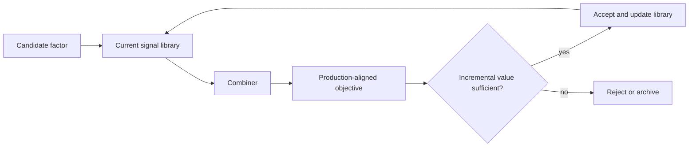

The value of an alpha is conditional on what is already in the signal library. In this post, a *formulaic alpha*—also called a factor or signal—is a rule that turns point-in-time market data into a forecast or score for subsequent returns. A formula can have a strong standalone information coefficient (IC) and still add almost nothing to a model that already captures the same pattern. Here, IC means a pre-specified association (often a correlation or rank correlation) between that score and later returns; it is a prediction diagnostic, not a claim about net trading value. Conversely, a weaker formula can be the better addition when it explains a part of future returns that the present ensemble misses.

This changes what we mean by alpha quality. The relevant question is not merely, “Does this alpha predict?” It is, “What does this alpha add that my current model does not already know?”

*NotebookLM-generated infographic. The values shown are illustrative and are not backtest results.*

## 1. A small example changes the ranking

Suppose a library already contains a medium-term momentum signal. Two candidates are available:

| Candidate | Standalone IC | Relation to the library | Illustrative held-out library utility |
|---|---:|---|---|
| Baseline library $\mathcal F$ | — | Existing medium-term momentum | $Q(\mathcal F)=0.400$ |
| $f_A$: another momentum variant | 0.050 | Largely repeats the existing momentum pattern | $Q(\mathcal F\cup\{f_A\})=0.402$ |
| $f_B$: a liquidity-stress signal | 0.030 | Captures a different conditional pattern | $Q(\mathcal F\cup\{f_B\})=0.409$ |

Ranking candidates by standalone IC picks $f_A$, whereas the library-level comparison prefers $f_B$. The numbers are synthetic, not a backtest: their purpose is to make the ranking reversal explicit and to separate *predictive strength in isolation* from *incremental usefulness in a library of signals*.

Here, “portfolio construction” means construction of a **portfolio of signals or factors**, not necessarily a portfolio of assets. A downstream model combines factor outputs into a forecast, score, or trading decision. The new factor is valuable only through its effect on that combined object.

## 2. Alpha mining is not only a ranking problem

Let $Q(\mathcal F; C,D,R)$ be a pre-specified, out-of-sample utility of a *library* $\mathcal F$, evaluated at a defined horizon and universe under a fixed combiner $C$, data/regime definition $D$, and regularization or constraints $R$. The evaluation protocol—including how the combiner is refit—must also be fixed before selection. To keep the notation readable, the arguments after $\mathcal F$ are omitted below.

Independent alpha mining has the form

$$
f^* = \arg\max_f Q(\{f\}),
$$

where a research implementation might use a standalone score such as IC as a cheap screen. It rewards formulas that look good one at a time.

Conditional selection instead asks for the next addition to a current library $\mathcal{F}_t$:

$$
f_{t+1} = \arg\max_f \Delta(f\mid\mathcal{F}_t).
$$

A general marginal-value definition is

$$
\Delta(f\mid\mathcal{F}) = Q(\mathcal{F}\cup\{f\}) - Q(\mathcal{F}).
$$

The objective changes after every accepted factor. A formula that is useful today can become redundant tomorrow once a similar signal enters the library. The candidate ranking is therefore conditional on the current library: selection is sequential, not a one-time ranking exercise.

## 3. Redundancy is broader than correlation

Pairwise correlation is a useful warning signal, but it is not the definition of redundancy. Two factors can have low raw correlation yet add little after a nonlinear combiner, a regime gate, or other factors explain the same return variation. Equally, correlated factors can sometimes be useful jointly when their exposures differ across regimes or costs.

The useful intuition is residual information: *what does the candidate predict that the existing library does not already explain?* In a simple linear setting, one can residualize a candidate against the current library and test whether its residual component retains association with the target. This connects alpha mining to conditional feature selection and forward selection: the next feature is judged after accounting for features already chosen.

Boosting provides a second, limited analogy. A new learner is useful because it addresses what the current ensemble leaves unexplained. Matching-pursuit and orthogonal methods make the same mathematical point: sequential components should explain a residual, rather than repeatedly fit the same dominant direction. These are analogies, not claims that alpha mining reduces to any one of those methods.

## 4. Alpha families are more important than alpha instances

Repeated search often discovers many expressions from one predictive family: short-window momentum, long-window momentum, smoothed momentum, or a momentum signal with slightly different normalization. Each may rank well by standalone IC. Together, they can create apparent formula diversity without much informational diversity.

The distinction is between an **alpha instance**—one expression—and an **alpha family**—a researcher-defined grouping of expressions with a similar hypothesized driver or exposure. Families are useful research labels, not objectively identified economic mechanisms. The research goal is often to discover a new predictive pattern, not merely another expression from an already crowded family.

This often implies diminishing marginal returns. After accepting $f_1$ from a family, a close relative $f_2$ commonly contributes less:

$$
\Delta(f_2\mid\mathcal{F}) > \Delta(f_2\mid\mathcal{F}\cup\{f_1\}).
$$

That inequality is conceptual, not universal. In an online or budget-constrained search, early acceptances can also alter which candidates are generated or affordable to test, creating order dependence. Even with a fixed pool, greedy selection is a practical heuristic rather than a guarantee of the best library.

## 5. Synergy is joint value, not merely low correlation

Two individually weak factors may be useful together. To distinguish synergy from redundancy, define the interaction term

$$
\Gamma_{ij\mid\mathcal F} = Q(\mathcal{F}\cup\{f_i,f_j\})-Q(\mathcal{F})-\Delta(f_i\mid\mathcal{F})-\Delta(f_j\mid\mathcal{F}).
$$

There is synergy when $\Gamma_{ij\mid\mathcal F}>0$; a negative value instead signals overlap or adverse interaction. For example, if each factor raises a baseline utility of $0.400$ to $0.401$, but the pair raises it to $0.407$, then $\Gamma=0.005$. This is the stronger meaning of synergy: actual joint incremental value under a specified combiner, not simply low pairwise correlation. It also explains why greedy addition is practical rather than globally optimal. Searching all factor subsets is generally expensive; a greedy procedure can miss a pair whose value emerges only in combination.

## 6. The combiner is part of the definition of value

The same candidate can be valuable under one combination method and useless under another. Its value should therefore be written as

$$
Q(\mathcal{F}\cup\{f\}; C, D, R),
$$

where $C$ is the combiner, $D$ is the data and market regime, and $R$ denotes regularization or constraints. A linear, ridge-regularized model; a regime-switching model; and a turnover-constrained optimizer can assign different marginal values to the same formula.

There is no universally “good” alpha in the operational sense. There is only a useful alpha relative to a current model and environment. Standalone IC measures one property. Marginal contribution measures another.

## 7. The objective should match production

Research often optimizes IC while production optimizes combined, cost-aware P&L. That is an objective mismatch. If production cares about risk-adjusted return, turnover, drawdown, and exposures, the search objective should be aligned with that utility, for example:

$$
Q = \operatorname{Sharpe} - \lambda_1\operatorname{Turnover} - \lambda_2\operatorname{Drawdown} - \lambda_3\operatorname{ExposurePenalty}.
$$

The coefficients $\lambda_1,\lambda_2,\lambda_3$ encode trade-offs among the strategy’s objectives; hard limits should be represented as constraints rather than silently treated as penalties. This is not an argument that every search should optimize a noisy realized Sharpe directly. It is an argument that the final selection stage should reward the object that matters in production, including capacity, transaction costs, turnover, and exposure limits.

An information-theoretic restatement is helpful but need not dominate the analysis: $I(f;y\mid\mathcal{F})$ measures conditional statistical dependence between a candidate $f$ and future returns $y$ after accounting for the library. It is a diagnostic proxy, not a production objective: the dependence may be unstable, inaccessible to the combiner, or uneconomic after costs.

## 8. A practical two-stage search

Portfolio-aware evaluation is more expensive than standalone screening because the ensemble must be recomputed repeatedly. A practical architecture is therefore two-stage:

1. **Generate and filter.** Use inexpensive checks for point-in-time/no-lookahead validity, implementation feasibility, and obvious duplication. Keep the standalone-quality threshold permissive so that a weak but complementary candidate is not discarded automatically.
2. **Evaluate marginal value.** Apply the expensive, combiner-aware test to promising candidates using the current library and production constraints. Reserve a small, diversity-preserving sample for pair or group evaluation, because some value appears only jointly.

This preserves breadth early in the search while reserving expensive portfolio evaluation for candidates with a plausible chance of adding residual information.

## 9. Important qualifications

> **Selection leakage.** Repeatedly selecting factors on one validation period gradually turns that period into training data. Use temporally ordered, nested or walk-forward evaluation: refit the combiner and choose candidates within each selection window, account for the number of adaptive trials and a pre-specified stopping rule, then reserve a final untouched test set for one frozen-library evaluation.

Marginal value is also regime-dependent. A more realistic object is $\Delta_t(f\mid\mathcal{F}_t)$: the contribution can change as market conditions, the library, costs, and exposures change. Rebalancing or replacing a factor should therefore be governed by a pre-specified protocol, not by an after-the-fact response to one disappointing period.

## 10. AlphaGen as one implementation example

Systems such as [AlphaGen](https://arxiv.org/abs/2306.12964) operationalize variants of this principle by rewarding formulas according to the performance of an updated factor collection rather than only their isolated score. Its contribution is implementation-specific; the broader argument does not depend on that framework. Any alpha-mining system that feeds signals into a combined production model faces the same conditional-value problem.

## Conclusion

The best next alpha is not necessarily the best standalone alpha. It is the factor that improves a defined signal ensemble under a defined combiner, data regime, and set of production constraints. The broader implication is architectural: an alpha-research system should remember what it already knows, evaluate additions against that state, and preserve an honest final test as it learns. This shifts alpha mining from collecting high-scoring formulas to discovering new residual information.

$$
\boxed{\text{What does this alpha add that my current model does not already know?}}
$$

## References

1. S. Yu et al., [Generating Synergistic Formulaic Alpha Collections via Reinforcement Learning](https://arxiv.org/abs/2306.12964), 2023.
